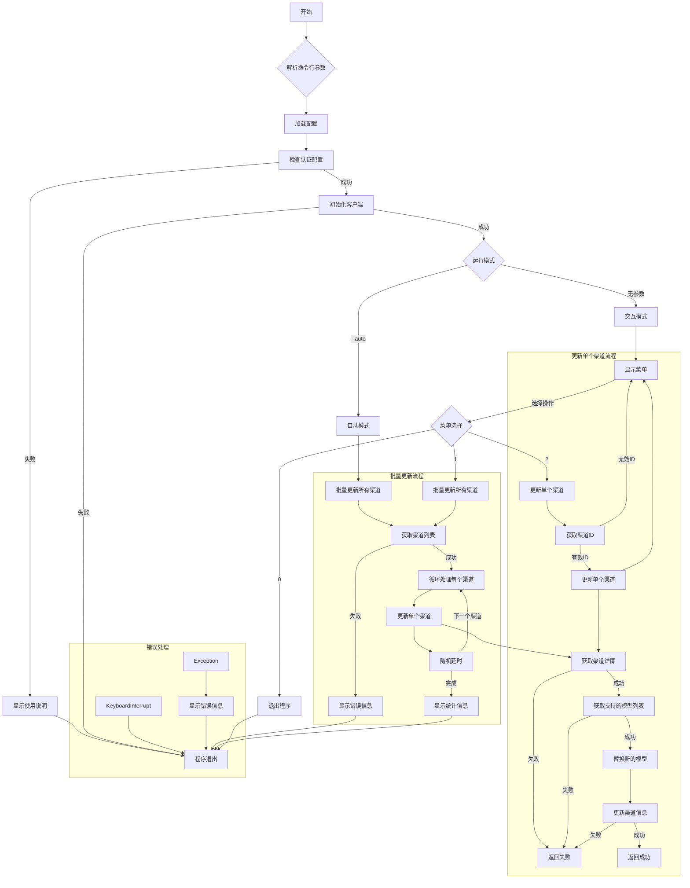

# 渠道更新工具

## 项目简介

这是一个用于更新API渠道的Python工具。它支持批量更新所有渠道或更新单个渠道。该工具可以与不同类型的API客户端（OneHub、OneAPI、NewAPI）配合使用。

## 功能特点

- 支持批量更新所有渠道
- 支持更新单个渠道
- 灵活的认证方式（Bearer token或用户名密码）
- 可配置的目标渠道状态
- 可调节的更新延迟时间
- 支持多种客户端类型

## 安装说明

1. 克隆仓库到本地：

    ```
    git clone https://github.com/candies404/autodate_channel_models.git
    cd autodate_channel_models
    ```
   
2. 安装依赖：

    `pip install -r requirements.txt`

3. 复制`.env.example`文件并重命名为`.env`：

    `cp .env.example .env`

4. 编辑`.env`文件，填写必要的配置信息。

## 配置说明

在`.env`文件中配置以下参数：

- `API_BASE_URL`：API基础地址（必需）
- `API_ACCESS_TOKEN`：access token（优先使用）
- `API_USERNAME`：用户名（使用账号密码认证时必需）
- `API_PASSWORD`：密码（使用账号密码认证时必需）
- `TARGET_CHANNEL_STATUS`：目标渠道状态（可选，默认0）
- `DELAY_TIME`：更新渠道之间的随机休眠时间最大值（可选，默认3.0秒）
- `CLIENT_TYPE`：客户端类型（可选，默认onehub）

目标渠道状态说明：
- 0：所有状态
- 1：启用
- 2：手动关闭
- 3：自动关闭

## 使用方法

运行主程序：

python app.py

按照屏幕提示选择操作：
1. 批量更新所有渠道
2. 更新单个渠道
0. 退出程序

## 开发说明

- `app.py`：主程序入口
- `clients/`：包含不同类型的API客户端实现
    - `base_client.py`：基础客户端类
    - `onehub_client.py`：OneHub客户端实现
    - `oneapi_client.py`：OneAPI客户端实现（待实现）
    - `newapi_client.py`：NewAPI客户端实现（待实现）

要添加新的客户端类型，请在`clients/`目录下创建新的客户端类，并确保实现`BaseAPIClient`中定义的所有方法。

## 注意事项

- 请确保在使用前正确配置`.env`文件
- 使用账号密码认证时，请妥善保管您的凭据
- 批量更新时请注意设置合理的延迟时间，以避免对API服务器造成过大压力

## 流程图



## 贡献指南

欢迎提交问题报告和改进建议。
